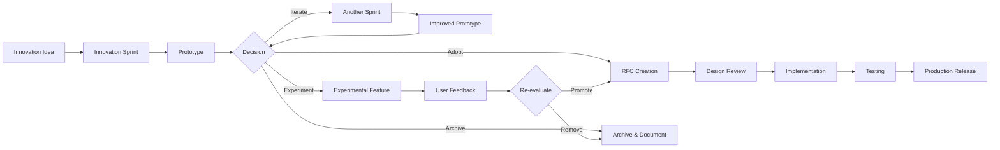

# Innovation Sprint Plan

**Version**: 1.0.0
**Status**: Active Framework
**Last Updated**: 2025-11-06

---

## 🎯 Innovation Strategy

SpectralChain follows a dual-track development model:
1. **Stable Track**: Maintenance and incremental improvements (80% effort)
2. **Innovation Track**: Experimentation and breakthrough features (20% effort)

---

## 📅 Sprint Cadence

### Iteration Cycle

```
┌─────────────────────────────────────────────────────────────┐
│                    6-Week Iteration Cycle                    │
├─────────────────────────────────────────────────────────────┤
│                                                               │
│  Week 1-2: Development Sprint                                │
│  ├─ Feature development                                      │
│  ├─ Bug fixes                                                │
│  └─ Technical debt reduction                                 │
│                                                               │
│  Week 3-4: Stabilization Sprint                              │
│  ├─ Testing and QA                                           │
│  ├─ Documentation                                            │
│  └─ Code review                                              │
│                                                               │
│  Week 5: Innovation Sprint                                   │
│  ├─ Experimental features                                    │
│  ├─ Research & prototyping                                   │
│  └─ Technical exploration                                    │
│                                                               │
│  Week 6: Release & Planning                                  │
│  ├─ Release preparation                                      │
│  ├─ Retrospective                                            │
│  └─ Next cycle planning                                      │
│                                                               │
└─────────────────────────────────────────────────────────────┘
```

---

## 🔬 Innovation Sprints

### Sprint Structure

**Duration**: 1 week (5 working days)
**Frequency**: Every 6 weeks
**Participation**: Entire team
**Outcome**: Prototype, RFC, or proof-of-concept

### Innovation Sprint Goals

1. **Explore**: Research new technologies and approaches
2. **Prototype**: Build proof-of-concepts
3. **Experiment**: Test unconventional ideas
4. **Learn**: Gain knowledge for future features
5. **Inspire**: Foster creativity and team growth

---

## 📋 Innovation Sprint Process

### Pre-Sprint (Week 5, Day 5)

**Planning Meeting** (2 hours):
```markdown
Agenda:
1. Review innovation backlog
2. Select sprint themes
3. Form teams (2-4 people)
4. Define success criteria
5. Allocate resources
```

**Innovation Backlog**:
```json
{
  "innovation_ideas": [
    {
      "id": "INN-001",
      "title": "Quantum-Resistant Cryptography",
      "theme": "Security",
      "proposer": "@alice",
      "votes": 15,
      "effort": "medium",
      "risk": "low"
    },
    {
      "id": "INN-002",
      "title": "AI-Powered Query Optimization",
      "theme": "Performance",
      "proposer": "@bob",
      "votes": 12,
      "effort": "high",
      "risk": "medium"
    }
  ]
}
```

### Sprint Week (Week 5)

#### Day 1: Kickoff & Research
- **Morning**: Sprint kickoff meeting
- **Afternoon**: Research and exploration
- **Output**: Research document

#### Day 2-3: Development
- **Focus**: Build prototype
- **Activities**: Coding, testing, iterating
- **Output**: Working prototype

#### Day 4: Polish & Documentation
- **Focus**: Finalize prototype
- **Activities**: Testing, documentation, demo prep
- **Output**: Demo-ready prototype

#### Day 5: Demo & Decision
- **Morning**: Team demos
- **Afternoon**: Retrospective and decision-making
- **Output**: Decision on next steps

### Post-Sprint (Week 6, Day 1)

**Decision Meeting** (1 hour):
```markdown
For each prototype:
1. Demo review
2. Impact assessment
3. Effort estimation
4. Decision:
   ├─ Adopt: Add to roadmap
   ├─ Iterate: Another innovation sprint
   ├─ Archive: Document and shelve
   └─ Experiment: Keep as experimental feature
```

---

## 🎨 Innovation Themes

### Theme Rotation

Each sprint focuses on 2-3 themes from this rotation:

```
Quarter 1:
├─ Week 5: Privacy & Security
├─ Week 11: Performance & Scalability
└─ Week 17: Developer Experience

Quarter 2:
├─ Week 23: User Interface & Experience
├─ Week 29: Integration & Ecosystem
└─ Week 35: Research & Algorithms

Quarter 3:
├─ Week 41: Infrastructure & Operations
├─ Week 47: Testing & Quality
└─ Week 53: Documentation & Education

Quarter 4:
├─ Week 59: Community & Governance
├─ Week 65: Business & Monetization
└─ Week 71: Wild Card (team choice)
```

### Theme Descriptions

#### 1. Privacy & Security
**Focus**: Enhance privacy and security features

**Example Projects**:
- Quantum-resistant cryptography
- Advanced steganography
- Homomorphic encryption
- Secure multi-party computation

**Success Metrics**:
- Security analysis report
- Performance benchmarks
- Integration plan

#### 2. Performance & Scalability
**Focus**: Improve performance and scale

**Example Projects**:
- Database sharding
- Query optimization
- Caching strategies
- Distributed processing

**Success Metrics**:
- Performance benchmarks
- Scalability analysis
- Resource usage comparison

#### 3. Developer Experience
**Focus**: Improve developer tools and APIs

**Example Projects**:
- New SDK language bindings
- Development tools
- API improvements
- Debug/profiling tools

**Success Metrics**:
- Developer survey results
- API usage analytics
- Tool adoption rate

#### 4. User Interface & Experience
**Focus**: Enhance user-facing interfaces

**Example Projects**:
- Web dashboard
- CLI improvements
- Mobile app
- Visualization tools

**Success Metrics**:
- User testing feedback
- Usability metrics
- Adoption rate

#### 5. Integration & Ecosystem
**Focus**: Integrate with other systems

**Example Projects**:
- Cloud provider integrations
- Third-party tool support
- Plugin system
- Marketplace

**Success Metrics**:
- Integration completeness
- Partnership opportunities
- Ecosystem growth

#### 6. Research & Algorithms
**Focus**: Explore new algorithms and approaches

**Example Projects**:
- Novel consensus mechanisms
- Advanced cryptography
- Quantum algorithms
- AI/ML applications

**Success Metrics**:
- Research paper potential
- Patent possibilities
- Novelty assessment

---

## 🏆 Innovation Sprint Examples

### Example 1: Quantum-Resistant Cryptography

**Sprint Goal**: Explore post-quantum cryptographic algorithms

**Team**: 3 people (1 week)

**Day 1: Research**
```markdown
Research Topics:
- NIST post-quantum candidates
- Lattice-based cryptography
- Hash-based signatures
- Performance characteristics

Deliverable: Research summary document
```

**Day 2-3: Prototype**
```rust
// Prototype implementation
pub mod quantum_resistant {
    use pqcrypto_dilithium::dilithium5;

    pub fn sign(message: &[u8], secret_key: &[u8]) -> Vec<u8> {
        // Dilithium signature implementation
    }

    pub fn verify(message: &[u8], signature: &[u8], public_key: &[u8]) -> bool {
        // Verification implementation
    }
}

#[cfg(test)]
mod tests {
    // Comprehensive tests
}
```

**Day 4: Benchmark & Document**
```markdown
## Quantum-Resistant Cryptography Prototype

### Algorithm: Dilithium (NIST PQC finalist)

### Performance
- Sign: 1.2ms (vs RSA: 0.3ms)
- Verify: 0.8ms (vs RSA: 0.1ms)
- Key size: 2.5KB (vs RSA: 0.5KB)

### Security
- Quantum-resistant: Yes
- Classical security: 256-bit equivalent

### Integration Plan
- Phase 1: Add as optional feature
- Phase 2: Parallel operation with RSA
- Phase 3: Migrate to default (v3.0)

### Recommendation: ✅ Adopt
```

**Day 5: Demo & Decision**
```markdown
Demo: Live demonstration of signing and verification

Decision: ✅ Adopt
- Add to roadmap for v2.5
- Assign to security team
- Create RFC for design review
```

### Example 2: AI-Powered Query Optimization

**Sprint Goal**: Use ML to optimize vector search queries

**Team**: 4 people (1 week)

**Approach**:
1. Collect query patterns from production
2. Train ML model to predict optimal parameters
3. Benchmark against baseline
4. Document findings

**Outcome**:
```markdown
## AI Query Optimization Results

### Performance Improvement
- Average query time: -30%
- P95 query time: -45%
- Cache hit rate: +20%

### Model Details
- Algorithm: Gradient Boosting
- Features: 15 (query characteristics)
- Training data: 100K queries
- Accuracy: 87%

### Challenges
- Model deployment complexity
- Cold start performance
- Maintenance burden

### Recommendation: 🔄 Iterate
- Simplify model deployment
- Improve cold start
- Next sprint: Production integration
```

---

## 📊 Innovation Metrics

### Sprint Success Metrics

```json
{
  "sprint_metrics": {
    "completion_rate": 0.85,        // Target: ≥ 0.80
    "prototype_quality": 4.2,       // Target: ≥ 4.0 (1-5 scale)
    "adoption_rate": 0.40,          // Target: ≥ 0.30
    "team_satisfaction": 4.5,       // Target: ≥ 4.0 (1-5 scale)
    "learning_value": 4.8           // Target: ≥ 4.0 (1-5 scale)
  },
  "outcomes": {
    "adopted": 4,
    "iterated": 2,
    "archived": 3,
    "experimental": 1
  }
}
```

### Long-Term Innovation Metrics

```json
{
  "yearly_metrics": {
    "innovation_sprints_completed": 8,
    "prototypes_created": 20,
    "features_adopted": 8,
    "patents_filed": 2,
    "papers_published": 1,
    "team_growth": "+15%"
  },
  "impact": {
    "performance_improvements": "35%",
    "new_capabilities": 12,
    "developer_satisfaction": 4.6,
    "competitive_advantage": "High"
  }
}
```

---

## 🎯 Innovation Backlog Management

### Adding Ideas

**Via GitHub**:
```bash
# Create innovation proposal
gh issue create \
  --title "[INNOVATION] AI-Powered Query Optimization" \
  --label "innovation" \
  --body-file innovation-proposal.md
```

**Proposal Template**:
```markdown
## Innovation Proposal

### Title
AI-Powered Query Optimization

### Theme
Performance & Scalability

### Problem
Current query optimization is manual and suboptimal

### Proposed Solution
Use ML to automatically optimize queries based on historical patterns

### Expected Impact
- 30% faster queries
- Better resource utilization
- Adaptive to workload changes

### Effort Estimate
Medium (1 sprint)

### Risk Level
Medium (deployment complexity)

### Success Criteria
- Prototype demonstrates 20%+ improvement
- Production-ready architecture
- Clear integration path

### Resources Needed
- 4 people
- Access to production query logs
- ML training infrastructure
```

### Prioritization

**Voting System**:
- Team members vote on proposals
- Each person gets 10 votes per quarter
- Top-voted ideas enter sprint planning

**Scoring Matrix**:
```
Impact: Low (1) | Medium (2) | High (3)
Effort: Low (1) | Medium (2) | High (3)
Risk:   Low (1) | Medium (2) | High (3)

Score = (Impact * 2) - Effort - Risk

Examples:
- High impact, low effort, low risk: Score = 6-1-1 = 4 ✅
- Medium impact, high effort, high risk: Score = 4-3-3 = -2 ❌
```

---

## 🔄 Innovation Sprint Retrospective

### Retrospective Template

```markdown
## Sprint Retrospective: [Sprint Name]

### What Went Well
- [Successes]
- [Unexpected benefits]
- [Team highlights]

### What Could Be Improved
- [Challenges faced]
- [Process issues]
- [Resource constraints]

### Lessons Learned
- [Technical insights]
- [Process learnings]
- [Team dynamics]

### Action Items
- [ ] [Improvement 1]
- [ ] [Improvement 2]
- [ ] [Improvement 3]

### Metrics
- Completion: X/Y prototypes
- Quality: 4.2/5.0
- Satisfaction: 4.5/5.0

### Decisions
- Adopted: [List]
- Iterated: [List]
- Archived: [List]
```

---

## 📚 Innovation Resources

### Research Budget

**Annual Innovation Budget**:
```
Total: $100,000
├─ Tools & Infrastructure: $30,000
│  ├─ Cloud resources
│  ├─ Development tools
│  └─ Testing infrastructure
├─ Education & Training: $25,000
│  ├─ Conferences
│  ├─ Courses
│  └─ Books
├─ Prototyping: $30,000
│  ├─ Proof-of-concept development
│  ├─ Third-party services
│  └─ Hardware
└─ Research & Patents: $15,000
   ├─ Patent applications
   ├─ Research collaborations
   └─ Academic partnerships
```

### Learning Resources

**For Team Members**:
- Conference attendance (2 per person/year)
- Online course subscriptions
- Book budget ($500 per person/year)
- Dedicated learning time (20% time)

**Knowledge Sharing**:
- Weekly tech talks
- Monthly innovation showcases
- Quarterly research symposiums
- Annual innovation summit

---

## 🚀 From Prototype to Production

### Adoption Path



### Adoption Criteria

**Must Have**:
- [ ] Clear use case
- [ ] Performance acceptable
- [ ] Security reviewed
- [ ] Documentation plan
- [ ] Maintenance plan
- [ ] No dead ends

**Should Have**:
- [ ] User demand demonstrated
- [ ] Competitive advantage
- [ ] Ecosystem fit
- [ ] Team expertise

**Nice to Have**:
- [ ] Patent potential
- [ ] Research paper potential
- [ ] Marketing opportunity

---

## 📅 Example: 2026 Innovation Roadmap

### Q1 2026

**Sprint 1 (Week 5)**: Privacy & Security
- Theme: Post-quantum cryptography
- Goal: Evaluate and prototype PQC algorithms
- Team: 3 people

**Sprint 2 (Week 11)**: Performance & Scalability
- Theme: Distributed ledger sharding
- Goal: Prototype horizontal scaling
- Team: 4 people

**Sprint 3 (Week 17)**: Developer Experience
- Theme: Python SDK
- Goal: Complete Python bindings
- Team: 2 people

### Q2 2026

**Sprint 4 (Week 23)**: User Interface & Experience
- Theme: Web dashboard
- Goal: Prototype monitoring dashboard
- Team: 3 people

**Sprint 5 (Week 29)**: Integration & Ecosystem
- Theme: Kubernetes operator
- Goal: Build K8s operator
- Team: 2 people

**Sprint 6 (Week 35)**: Research & Algorithms
- Theme: Novel consensus mechanism
- Goal: Research alternative consensus
- Team: 3 people

### Q3 2026

**Sprint 7 (Week 41)**: Infrastructure & Operations
- Theme: Observability
- Goal: Enhanced monitoring and tracing
- Team: 3 people

**Sprint 8 (Week 47)**: Testing & Quality
- Theme: Chaos engineering platform
- Goal: Automated chaos testing
- Team: 2 people

**Sprint 9 (Week 53)**: Documentation & Education
- Theme: Interactive tutorials
- Goal: Browser-based tutorials
- Team: 2 people

### Q4 2026

**Sprint 10 (Week 59)**: Community & Governance
- Theme: Community plugins
- Goal: Plugin system
- Team: 3 people

**Sprint 11 (Week 65)**: Business & Monetization
- Theme: Enterprise features
- Goal: Multi-tenancy prototype
- Team: 4 people

**Sprint 12 (Week 71)**: Wild Card
- Theme: Team choice
- Goal: Team-selected projects
- Team: All

---

## 🎉 Innovation Showcase

### Quarterly Showcase Event

**Format**: Half-day event (4 hours)

**Agenda**:
```
09:00 - 09:15: Opening & Sprint Overview
09:15 - 11:00: Prototype Demos (15 min each)
11:00 - 11:30: Break & Networking
11:30 - 12:30: Panel Discussion & Q&A
12:30 - 13:00: Closing & Next Quarter Preview
```

**Audience**:
- Internal team
- Stakeholders
- Early adopters
- Community members (livestream)

**Outcomes**:
- Visibility for innovation work
- Feedback collection
- Community engagement
- Recruiting opportunity

---

## 📞 Innovation Support

### Innovation Champions

Each theme has a champion:
- **Privacy & Security**: @security-lead
- **Performance & Scalability**: @perf-lead
- **Developer Experience**: @devrel-lead
- **User Interface**: @design-lead
- **Integration**: @ecosystem-lead
- **Research**: @research-lead

**Responsibilities**:
- Mentor innovation teams
- Review proposals
- Connect with experts
- Advocate for adoption

### Office Hours

**Weekly Office Hours**:
- Tuesday 2-3 PM: Technical questions
- Thursday 2-3 PM: Innovation ideas
- Friday 2-3 PM: Demo & feedback

---

## 📚 Related Documents

- [Roadmap](./ROADMAP.md)
- [Release Checklist](./RELEASE_CHECKLIST_1.0.md)
- [No Dead Ends Policy](./NO_DEAD_ENDS_POLICY.md)
- [Contributing Guide](./CONTRIBUTING.md)

---

## 🔄 Plan Updates

This plan is reviewed quarterly and updated based on retrospectives.

**Version History**:
- 1.0.0 (2025-11-06): Initial innovation sprint plan

**Next Review**: 2026-02-06

---

**Questions?**
- Slack: #innovation
- Email: innovation@spectralchain.io
- Office Hours: See above

---

**🚀 Innovation is not a luxury—it's a necessity. Let's build the future together!**

---

**Last Updated**: 2025-11-06 | **Version**: 1.0.0
