# SpectralChain Architecture Diagrams

**Version**: 2.0.0
**Last Updated**: 2025-11-06

This document contains visual architecture diagrams using Mermaid notation.

---

## Table of Contents

1. [System Overview](#system-overview)
2. [Component Architecture](#component-architecture)
3. [Data Flow](#data-flow)
4. [API Architecture](#api-architecture)
5. [CLI Architecture](#cli-architecture)
6. [Processing Pipeline](#processing-pipeline)
7. [Ledger Architecture](#ledger-architecture)
8. [Ghost Network](#ghost-network)
9. [Quantum Operators](#quantum-operators)
10. [Deployment Architectures](#deployment-architectures)

---

## System Overview

### High-Level Architecture

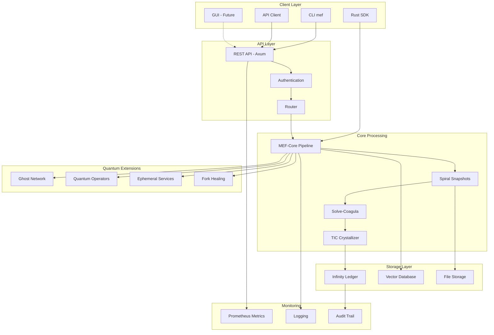

---

## Component Architecture

### Core Module Dependencies

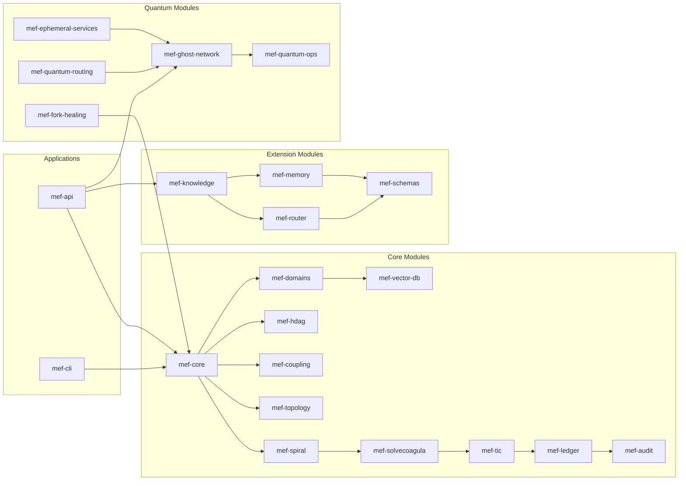

---

## Data Flow

### Ingest → Process → Ledger Flow

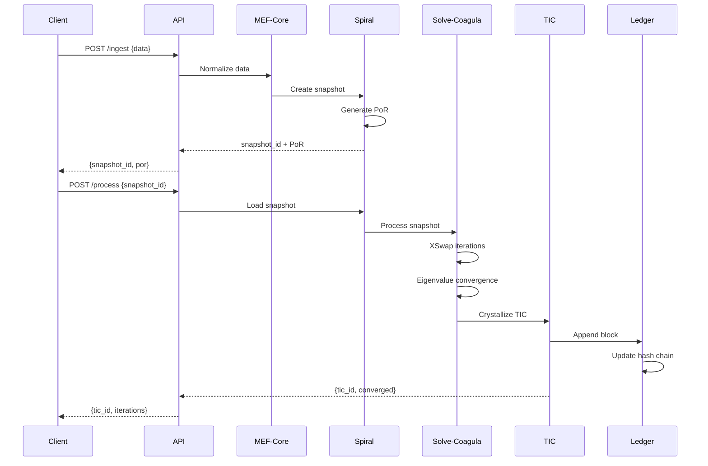

### Vector Search Flow

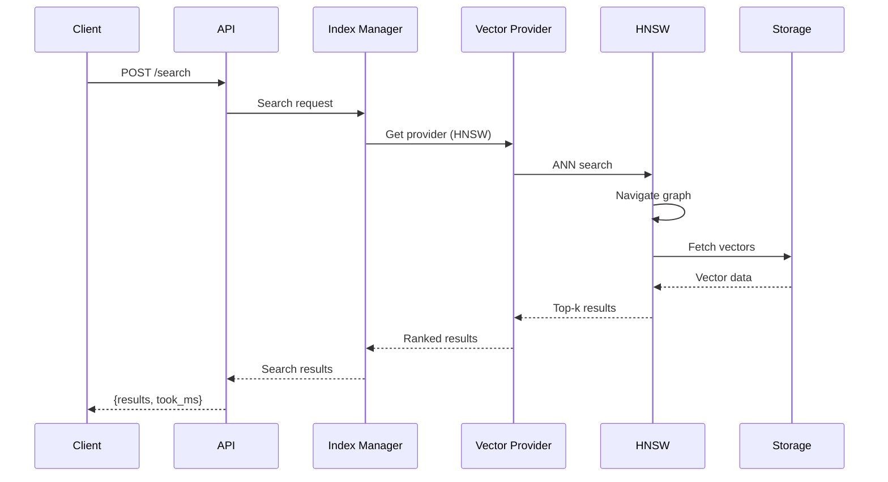

---

## API Architecture

### REST API Structure

```mermaid
graph TB
    subgraph "API Server"
        ENTRY[main.rs]
        CONFIG[Configuration]
        SERVER[Axum Server]

        subgraph "Middleware"
            AUTH_MW[Auth Middleware]
            LOGGING[Logging]
            CORS[CORS]
            METRICS_MW[Metrics]
        end

        subgraph "Routes"
            HEALTH[/health]
            INGEST[/ingest]
            PROCESS[/process]
            LEDGER_R[/ledger]
            VECTOR_R[/search]
            TIC_R[/tic]
            DOMAIN_R[/domain]
            METATRON_R[/metatron]
            ZK_R[/zk]
        end

        subgraph "Handlers"
            HEALTH_H[health_handler]
            INGEST_H[ingest_handler]
            PROCESS_H[process_handler]
            LEDGER_H[ledger_handler]
            VECTOR_H[search_handler]
        end

        STATE[AppState]
    end

    ENTRY --> CONFIG
    CONFIG --> SERVER
    SERVER --> AUTH_MW
    AUTH_MW --> LOGGING
    LOGGING --> CORS
    CORS --> METRICS_MW

    METRICS_MW --> HEALTH
    METRICS_MW --> INGEST
    METRICS_MW --> PROCESS
    METRICS_MW --> LEDGER_R
    METRICS_MW --> VECTOR_R

    HEALTH --> HEALTH_H
    INGEST --> INGEST_H
    PROCESS --> PROCESS_H
    LEDGER_R --> LEDGER_H
    VECTOR_R --> VECTOR_H

    HEALTH_H --> STATE
    INGEST_H --> STATE
    PROCESS_H --> STATE
    LEDGER_H --> STATE
    VECTOR_H --> STATE
```

---

## CLI Architecture

### Command Flow

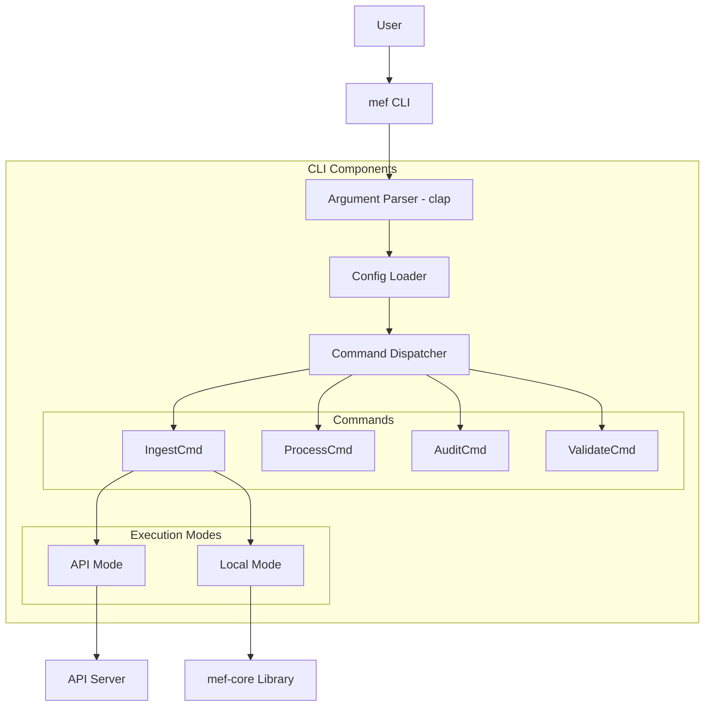

---

## Processing Pipeline

### MEF-Core Pipeline

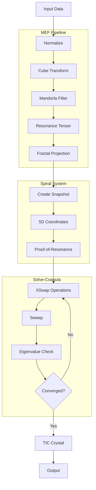

---

## Ledger Architecture

### Hash-Chained Ledger

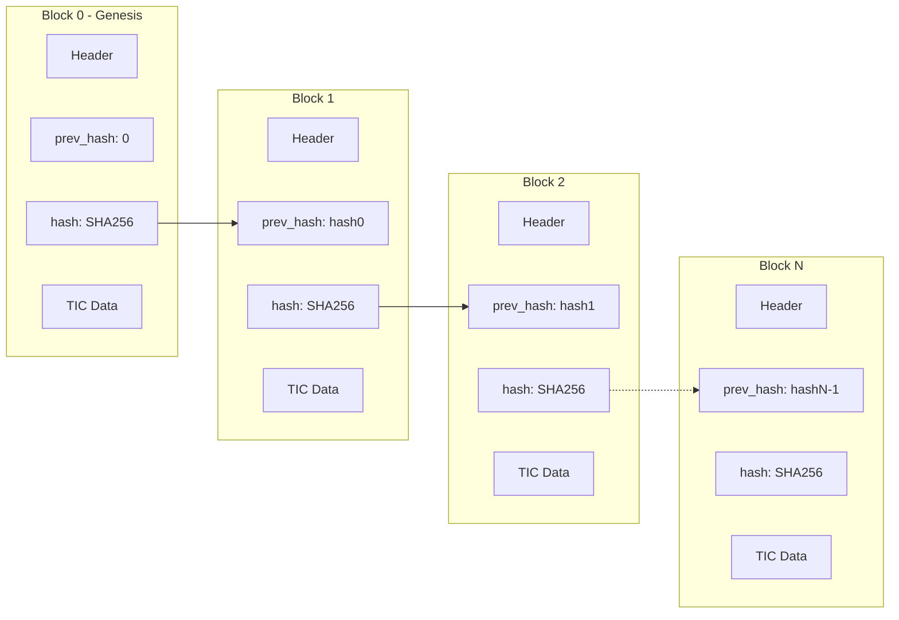

### Ledger Verification

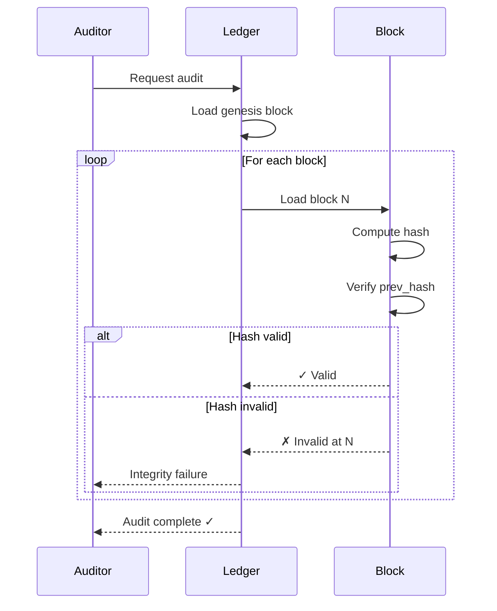

---

## Ghost Network

### Addressless Communication

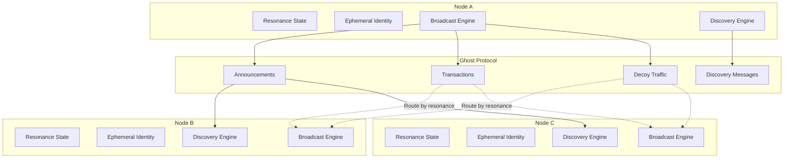

### Identity Rotation

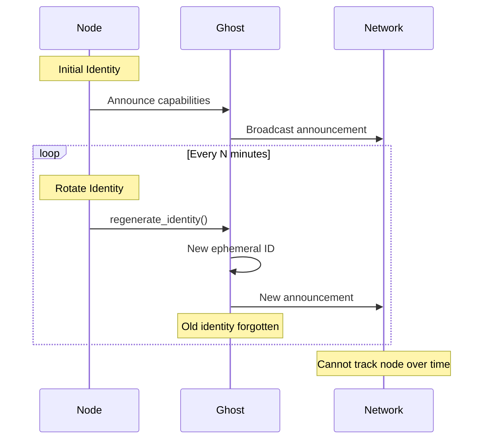

---

## Quantum Operators

### Operator Pipeline

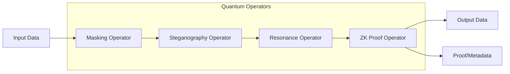

### Masking Operation

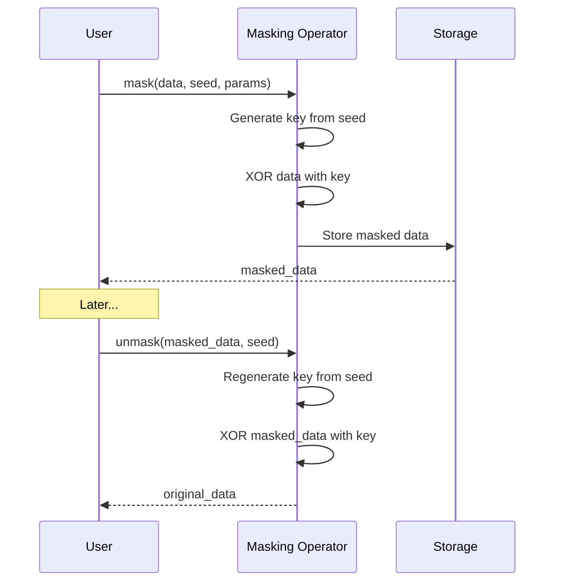

---

## Deployment Architectures

### Single-Node Deployment

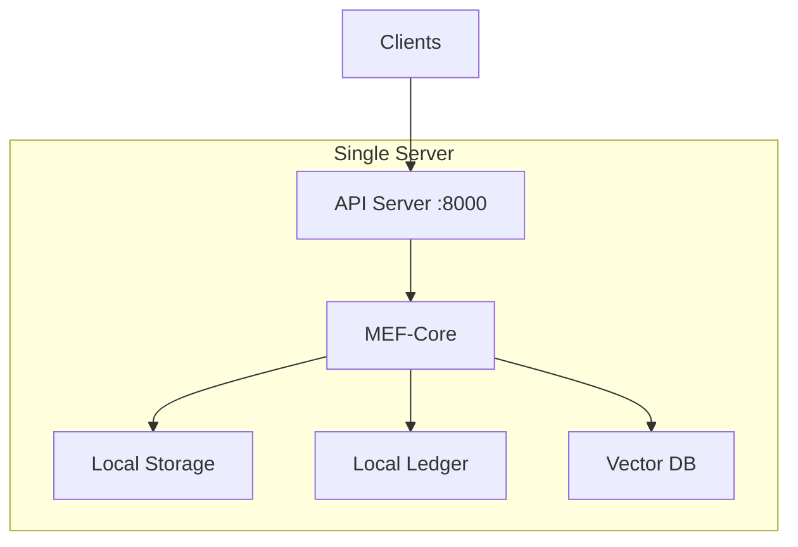

### Multi-Node Deployment

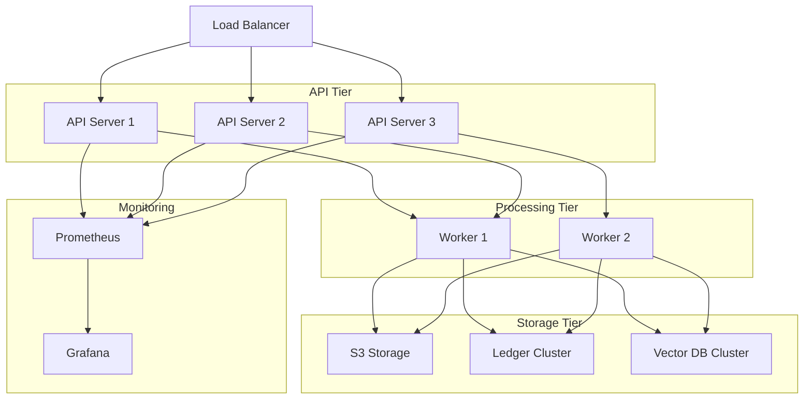

### Kubernetes Deployment

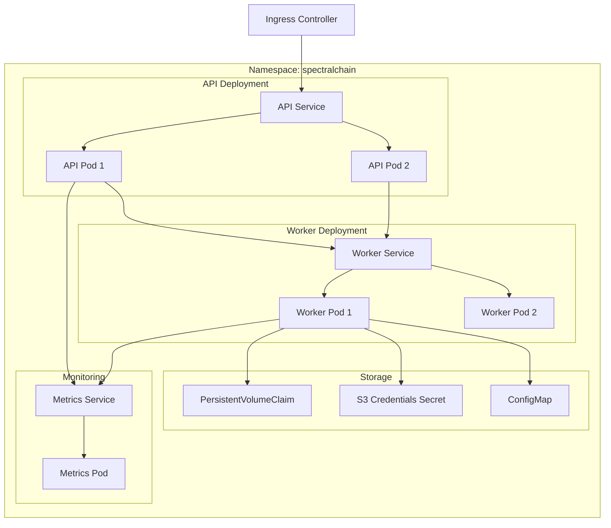

---

## Interactive Diagrams

For interactive exploration of these diagrams:
- View in GitHub (renders Mermaid automatically)
- Use [Mermaid Live Editor](https://mermaid.live/)
- Generate PNG/SVG: `make diagrams` (requires mmdc)

---

## Related Documentation

- [Quantum Resonant Architecture](./QUANTUM_RESONANT_ARCHITECTURE.md)
- [System Design Principles](./DESIGN_PRINCIPLES.md)
- [Component Interaction](./COMPONENT_INTERACTION.md)
- [API Reference](../api/README.md)

---

**Last Updated**: 2025-11-06 | **Version**: 2.0.0
